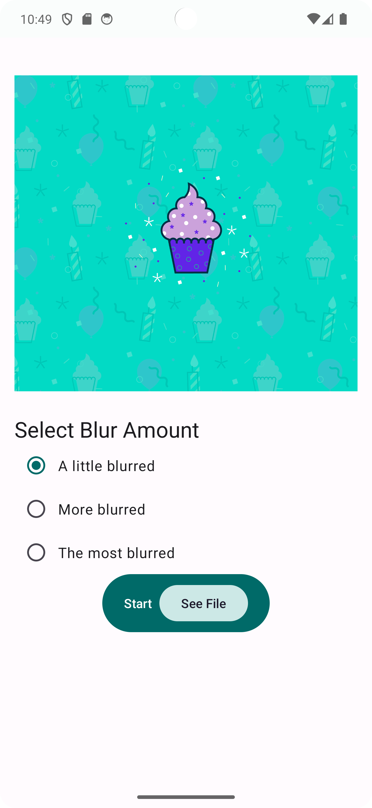
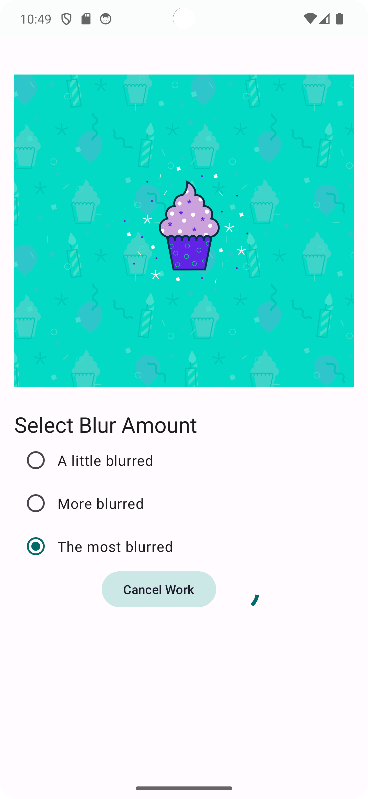
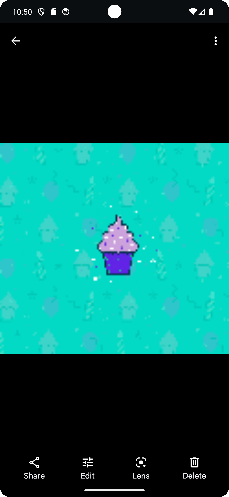

# Bluromatic

Bluromatic é um aplicativo Android que aplica efeitos de desfoque em imagens utilizando o WorkManager. Este projeto é uma implementação de exemplo para demonstrar o uso do WorkManager, Jetpack Compose e outras bibliotecas do Android. Essse projeto foi baseado nesse codelab: [WorkManager Codelab](https://developer.android.com/codelabs/basic-android-kotlin-compose-verify-background-work?continue=https%3A%2F%2Fdeveloper.android.com%2Fcourses%2Fpathways%2Fandroid-basics-compose-unit-7-pathway-1%23codelab-https%3A%2F%2Fdeveloper.android.com%2Fcodelabs%2Fbasic-android-kotlin-compose-verify-background-work#4).

## Índice

- [Funcionalidades](#funcionalidades)
- [Tecnologias Utilizadas](#tecnologias-utilizadas)
- [Capturas de Tela](#capturas-de-tela)
- [Instalação](#instalação)
- [Uso](#uso)
- [Estrutura do Projeto](#estrutura-do-projeto)
- [Licença](#licença)

## Funcionalidades

- Aplicação de diferentes níveis de desfoque em imagens.
- Visualização da imagem desfocada.
- Cancelamento de tarefas de desfoque em andamento.
- Interface de usuário moderna com Jetpack Compose.

## Tecnologias Utilizadas

- **WorkManager**: Para gerenciar e agendar tarefas assíncronas que continuam mesmo que o aplicativo seja encerrado.
- **Jetpack Compose**: Para criar interfaces de usuário modernas e responsivas.
- **Kotlin Coroutines**: Para operações assíncronas e gerenciamento de threads.
- **NotificationCompat**: Para mostrar notificações durante a execução das tarefas de desfoque e salvamento.
- **Bitmap**: Para manipulação e processamento de imagens.
- **ContentResolver**: Para acessar e salvar imagens no armazenamento do dispositivo.

## Capturas de Tela

## Instalação

1. Clone este repositório 
2. Abra o projeto no Android Studio.
3. Sincronize o projeto com Gradle para baixar todas as dependências necessárias.

## Uso
1. Execute o aplicativo em um dispositivo Android ou emulador.

2. Na tela principal, selecione o nível de desfoque desejado.

3. Clique no botão "Start" para iniciar o processo de desfoque.

4. Após a conclusão, você pode visualizar a imagem desfocada ou cancelar o processo a qualquer momento.

## Estrutura do Projeto

- `data/`: Contém as classes relacionadas ao repositório e aos dados da aplicação.
  - `AppContainer.kt`: Define a interface e a implementação do contêiner de dependências.
  - `BlurAmount.kt`: Modelo de dados para os níveis de desfoque.
  - `BlurAmountData.kt`: Dados estáticos dos níveis de desfoque.
  - `BluromaticRepository.kt`: Interface do repositório.
  - `WorkManagerBluromaticRepository.kt`: Implementação do repositório utilizando o WorkManager.

- `ui/`: Contém as classes e funções relacionadas à interface do usuário.
  - `BluromaticScreen.kt`: Tela principal do aplicativo.
  - `BlurViewModel.kt`: ViewModel para gerenciar o estado da tela.

- `workers/`: Contém as classes relacionadas às tarefas de trabalho do WorkManager.
  - `BlurWorker.kt`: Tarefa de trabalho para aplicar o desfoque.
  - `CleanupWorker.kt`: Tarefa de limpeza.
  - `SaveImageToFileWorker.kt`: Tarefa para salvar a imagem em um arquivo.
  - `WorkerUtils.kt`: Utilitários para criar notificações e manipular imagens.

